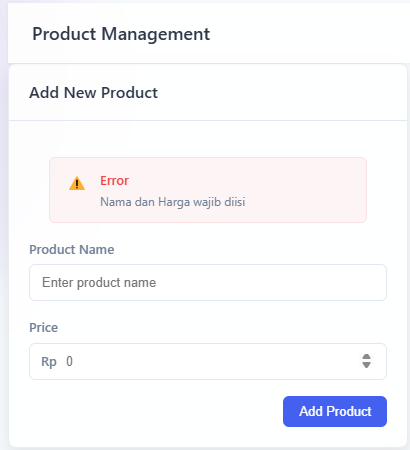
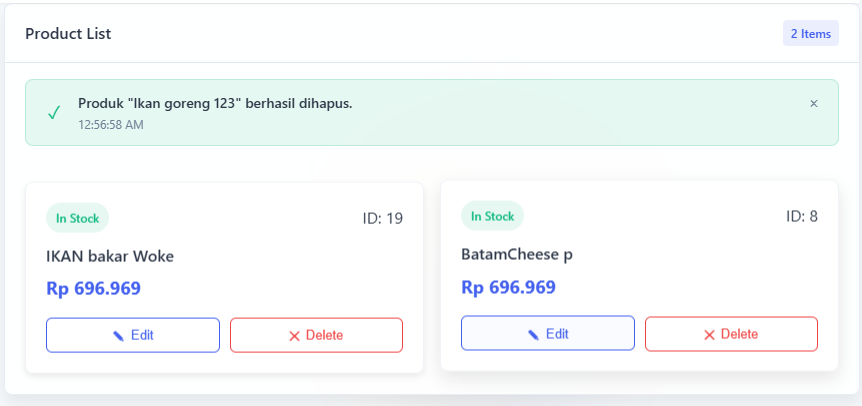

# E-Commerce Admin Dashboard

Aplikasi full-stack untuk manajemen produk e-commerce dengan frontend React dan backend Node.js


## 📋 Deskripsi Proyek

Aplikasi ini adalah dashboard admin untuk e-commerce yang memungkinkan pengguna melakukan operasi CRUD terhadap produk. Dilengkapi dengan antarmuka pengguna modern, animasi, dan responsif di berbagai perangkat.

## 🚀 Fitur Utama

- Dashboard statistik dengan ringkasan data bisnis
- Manajemen produk (tambah, lihat, edit, hapus)
- *Tambah*

  

   Saat hendak menambahkan barang namun pengguna tidak mengisi semua field maka akan muncul error

   

   Saat pengguna berhasil menambahkan barang maka akan muncul notifikasi success

- *Lihat*


   Saat pengguna berhasil menambahkan barang maka akan muncul di bagian kanan layar

- *Hapus*


   Saat pengguna ingin menghapus maka tombol hapus akan menjadi merah dan ketika pengguna menekannya akan muncul sebuah kontifmasi


   Dan saat ditekan tombol ya maka data akan terhapus dan muncul notifikasi success



- *Edit*


   Ketika pengguna ingin mengedit maka akan muncul form edit dan pengguna dapat mengubah data yang diinginkan


   Dan ketika sudah diubah maka akan muncul notifikasi success


- Antarmuka pengguna interaktif dengan animasi
- Konfirmasi dan notifikasi untuk setiap aksi
- Desain responsif untuk semua ukuran layar
- Validasi form sederhana

## 🔧 Teknologi

### Frontend
- React.js
- CSS murni dengan variabel kustom
- Axios untuk HTTP requests
- Vite sebagai build tool

### Backend
- Node.js
- Express.js
- JSON Server sebagai database
- RESTful API

## 📂 Struktur Proyek

```
e-commerce-admin/
├── frontend/             # Aplikasi React
│   ├── public/           # Aset statis
│   ├── src/              # Kode sumber frontend
│   │   ├── components/   # Komponen React
│   │   ├── App.jsx       # Komponen utama
│   │   └── ...           # File lainnya
│   └── README.md         # Dokumentasi frontend
│
├── backend/              # Server Node.js
│   ├── data/             # Data JSON
│   ├── routes/           # Endpoint API
│   ├── server.js         # Entry point backend
│   └── README.md         # Dokumentasi backend
│
└── README.md             # Dokumentasi utama
```

## 🏗️ Instalasi & Menjalankan Aplikasi

### Prasyarat
- Node.js (v14 atau lebih baru)
- npm atau yarn

### Langkah-langkah

1. Clone repositori ini
   ```bash
   git clone <repository-url>
   cd e-commerce-admin
   ```

2. Setup dan jalankan backend
   ```bash
   cd backend
   npm install
   npm start   # Server akan berjalan di http://localhost:3001
   ```

3. Setup dan jalankan frontend (dalam terminal terpisah)
   ```bash
   cd frontend
   npm install
   npm run dev   # Frontend akan berjalan di http://localhost:5173
   ```

4. Buka browser dan akses `http://localhost:5173`

## 📝 Penggunaan

1. **Dashboard**: Lihat ringkasan statistik bisnis
2. **Manajemen Produk**: 
   - Tambahkan produk baru dengan mengisi form
   - Lihat semua produk dalam layout card
   - Edit produk yang sudah ada
   - Hapus produk dengan konfirmasi

## 🔗 API Endpoints

Backend menyediakan endpoint API berikut:

- `GET /produk` - Mendapatkan semua produk
- `GET /produk/:id` - Mendapatkan produk berdasarkan ID
- `POST /produk` - Membuat produk baru
- `PUT /produk/:id` - Memperbarui produk
- `DELETE /produk/:id` - Menghapus produk


## 👥 Tim Pengembang

- [Putu Ngurah Semara](https://github.com/PutuNgurahSemara) - Frontend & Backend Developer (Bismillah)


